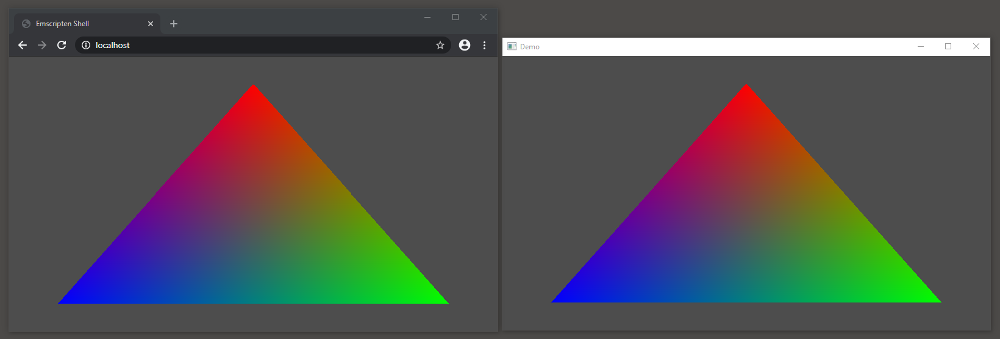

# "Hello, Triangle" WebGPU and Dawn

Starter project for C++ [WebGPU](//gpuweb.github.io/gpuweb/)/[Emscripten](//emscripten.org) and [Dawn](//dawn.googlesource.com/dawn). Build for Windows using Visual Studio from 2015 onwards. Build for Emscripten (on Windows) using `build-web.bat` (CMake project to follow). Tested with Chrome Canary 82.0 with the `--enable-unsafe-webgpu` flag. Build for Mac using the Xcode project (only tested with Xcode 11/macOS 10.14).

The included `libdawn` is pre-built for Windows/MSVC and Mac; [see instructions](lib/README.md) if you wish to build it yourself for Windows (out of the box Dawn on Windows builds with [Depot Tools](https://commondatastorage.googleapis.com/chrome-infra-docs/flat/depot_tools/docs/html/depot_tools.html)/Clang so MSVC's linker fails with the exposed `std` types).

Dawn is Apache 2.0 licensed (see [LICENSE](lib/dawn/LICENSE)). The example code is released under a [Creative Commons Zero license](//creativecommons.org/publicdomain/zero/1.0/) (or Public Domain, whichever is applicable in your jurisdiction).
